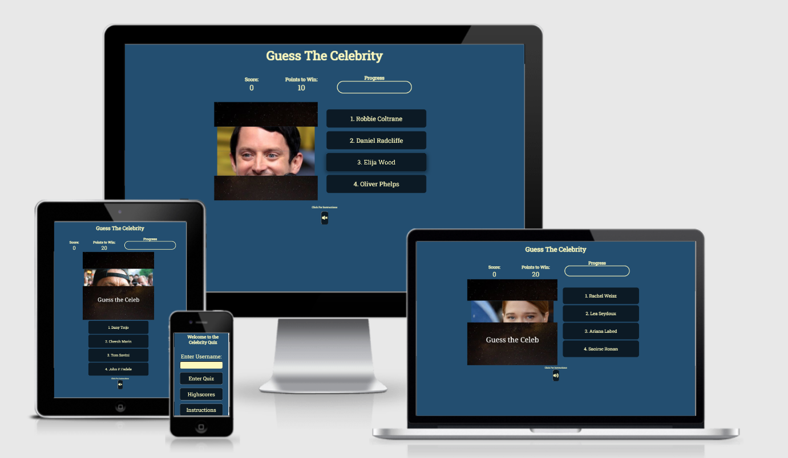

# Celebrity Quiz

The celebrity quiz is designed to be fully interactive, utilsing event listeners to create a image flip function which reveals a portion of a celebrity with each click. Each click then reduces the number of points which can be won in that particular round. the built in object, Math allows random question selection and order and sound effects are used to make the quiz engaging. It is designed to be responsive on multiple devices with a focus on simple, linear navigation. I chose this project mainly as a demonstration of the flexibility and range that Javascript allows.

Please see the final project [here](https://cwallacebailey.github.io/Project_2_Celebrity_Quiz/).

# User Experience

The overall aim for this project was to build an interactive and engaging quiz which could be enjoyed by anyone with no overall target audience other than celebrity fans. This target demographic is wide reaching and diverse and the quiz is designed so that questions can easily be added to expand the quiz. This enables it to remain interesting to both new and return users.  

## Design
---
### Colours

The color scheme is uniform throughout the quiz using hex #234E70 for the blue background with hex #FBF8BE yellow/ cream for the font color. Finally a complimentary navy was chosen for the quiz buttons (hex #0c1a25)

The background colour does not distract from the main features of the quiz and the font colour is easily read as it nicely contrasts with the background. 

[return to contents](<#contents>)

### Type Face
Throughout the site Roboto Slab has been used. It's an easy to read, neat font which doesn't distract from the overall appearance of the site.

In case Roboto Slab isn't supported in the browser sans serif is available as a backup. As with Roboto this is an easy to read font which is widely accessible on browsers so should always be available making it an ideal backup font.    

[return to contents](<#contents>)